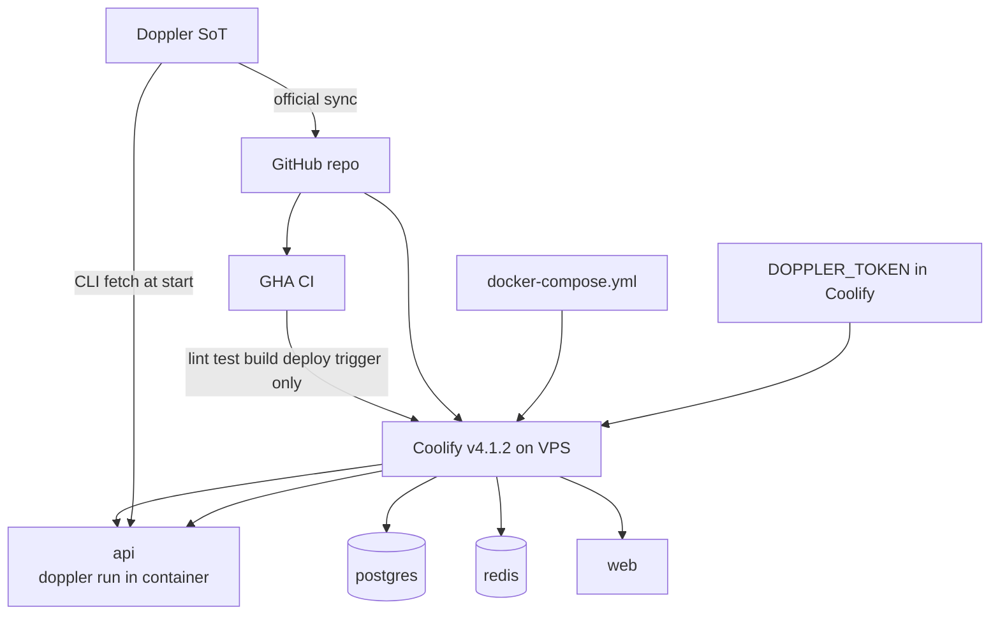
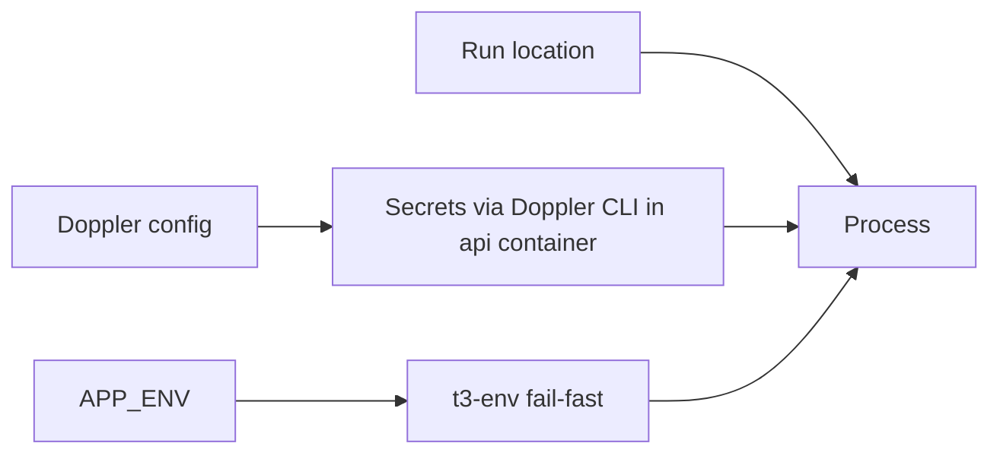

# Deploy secrets — Doppler + Coolify native compose

**Status:** accepted  
**Phase:** 0 (spec) · 0.5 (verify on VPS)  
**Date:** 2026-08-01

Secrets live in **Doppler** (source of truth). **Coolify v4.1.2** deploys `docker-compose.yml` as the single source of truth — no custom deploy shell scripts, no host-level `doppler run`, no manual secret copy into Coolify beyond a scoped **`DOPPLER_TOKEN`**.

The prior model wrapped Coolify in bespoke scripts (`build.sh`, `up.sh`, `smoke.sh`, `ensure-doppler.sh`, `doppler-validate.sh`) to run `doppler run` on the VPS host, strip host port bindings, patch Traefik labels, install Doppler into Coolify's helper container, and probe health by shelling into containers. Those scripts addressed a **misdiagnosed** preview-deployment failure (503/504). The root cause was a custom Docker network with `internal: true` in compose, which placed `api` on two networks; Traefik attached only to Coolify's network and non-deterministically routed to the unreachable custom-network IP ([Coolify docs — Do Not Define Custom Networks](https://coolify.io/docs/builds/packs/docker-compose); issues #4483, #6215, #6153). Removing custom networks and using Coolify's documented compose, domain, and magic-variable model eliminates the need for every workaround.

## Topology

## Compose — single source of truth

| Concern | Decision |
| --- | --- |
| Networks | **No custom networks** — Coolify creates one isolated bridge network per stack and joins Traefik to it; services reach each other by service name |
| Host ports | **None** — no `ports:` bindings; concurrent PR previews cannot collide on host port allocation |
| Postgres / Redis | No domain assigned in Coolify UI — never exposed beyond the private stack network |
| Health | Compose `healthcheck:` blocks; Coolify waits on them before marking deployment successful. Services that must not participate: `exclude_from_hc: true` ([Coolify docs](https://coolify.io/docs/knowledge-base/docker/compose)) |
| Custom scripts | **Removed** — Coolify's Docker Compose build pack runs compose directly |

## Domains and Coolify magic variables

Domains are assigned **per service** in the Coolify UI as `https://host:3000` (web) and `https://host:3001` (api). The port suffix tells the proxy which container port to forward to; it does **not** open a port on the host ([Coolify compose docs](https://coolify.io/docs/knowledge-base/docker/compose)).

Per-deployment values that no external secret store can know in advance are supplied by Coolify magic environment variables ([Coolify env docs](https://coolify.io/docs/knowledge-base/environment-variables)):

| Variable | Role |
| --- | --- |
| `SERVICE_URL_API_3001` | Public API URL for this deployment (preview subdomain from Preview URL Template) |
| `SERVICE_URL_WEB_3000` | Public web URL for this deployment |
| `SERVICE_PASSWORD_POSTGRES` | Postgres password — generated once by Coolify, persisted across deployments, same value everywhere referenced in compose |

## Doppler — container injection (api only)

| Piece | Behavior |
| --- | --- |
| **Coolify storage** | **`DOPPLER_TOKEN` only** — service token scoped to one Doppler config; declared as `${DOPPLER_TOKEN:?}` in compose so Coolify flags it and blocks deploy when unset |
| **api image** | Doppler CLI installed via Doppler's documented Alpine method; `CMD` is `doppler run -- bun dist/index.js` ([Doppler Dockerfile docs](https://docs.doppler.com/docs/dockerfile)) |
| **Writable config** | `DOPPLER_CONFIG_DIR=/tmp/.doppler` — required because the container runs with a read-only root filesystem |
| **web image** | **No Doppler CLI, no secrets** — only public `NEXT_PUBLIC_*` URLs as Docker build args (see Interim deviation below) |
| **GHA** | CI via Doppler↔GitHub sync for tests · deploy webhook/trigger only |
| **Fallback volume** | Skipped — Doppler down + restart = fail until recovered |

No secret is copied by hand into Coolify, GitHub, or elsewhere beyond the scoped token — no manual sync to drift.

## Web build — NEXT_PUBLIC at build time

The web Dockerfile accepts `NEXT_PUBLIC_APP_URL` and `NEXT_PUBLIC_API_URL` as **build args**; Coolify supplies values from `SERVICE_URL_*` magic variables at build time. Next.js inlines `NEXT_PUBLIC_*` into the client bundle during build — runtime `environment:` on the web service does not rewrite an already-built client bundle.

## Preview deployments

Coolify's native preview feature ([preview deploy docs](https://coolify.io/docs/applications/ci-cd/github/preview-deploy)):

| Requirement | Setting |
| --- | --- |
| GitHub App | `Pull requests` read/write; `Pull requests` event subscribed |
| Preview URL Template | `{{pr_id}}` (or equivalent per-host pattern) |
| DNS | Wildcard `A` record covering preview subdomains |
| Secrets isolation | Separate preview-scoped **`DOPPLER_TOKEN`** under Coolify **Preview Deployment Environment Variables** — PR builds never receive production secrets |

## Image build location

Images are built **on the Coolify host** from the git repository.

| Option | Outcome |
| --- | --- |
| **Build on Coolify host** (chosen) | Host has 6 cores and 12 GB RAM, lightly loaded — builds both images comfortably |
| **GHA build + push to GHCR** | **Deferred, not rejected** — GitHub Free includes 2,000 Actions minutes/month for private repos (binding constraint once the repo goes private); GHCR storage and bandwidth are currently free, so moving build later is cheap and reversible |

## Docker build — Turborepo excluded

Turborepo's documented Docker integration is `turbo prune --docker`, but that path is **unreliable for Bun lockfiles** — a pruned `bun.lock` is rejected by `bun install --frozen-lockfile` ([vercel/turborepo](https://github.com/vercel/turborepo) issues #12653, #12156, #12744, #12816, #12962). Turborepo's suggested workaround is adopting yarn or pnpm alongside Bun, which would mean maintaining a second lockfile that can drift.

| Layer | Decision |
| --- | --- |
| **Dockerfiles** | Copy the repository; run `bun install --frozen-lockfile --ignore-scripts`; build with `bun run build --filter=...` |
| **Turborepo** | Remains the task runner for lint, typecheck, test, and build **locally and in CI** |
| **Revisit** | Explicit decision to adopt `turbo prune` when Bun prune bugs are closed — not an oversight |

## Environment matrix

Three **independent** axes — not 1:1 mapped:

| Axis | Values | Purpose |
| --- | --- | --- |
| **APP_ENV** | `dev` \| `prod` | Runtime guards (`t3-env`, feature flags) |
| **Doppler config** | `dev` \| `prod` \| `dev_personal` | Secret payloads |
| **Run location** | local · Coolify resource | Where process executes |

**No staging environment** — only dev and prod configs. Personal experiments use `dev_personal`.

## Runtime config — not NEXT_PUBLIC (long-term)

Do **not** bake env-specific values into `NEXT_PUBLIC_*` at build time long-term. Same image runs everywhere; env-specific public config should come from:

- Server-injected config, or
- `/v1/config` runtime endpoint

### Interim deviation (2026-07-31)

Until `/v1/config` client bootstrap ships, the web Dockerfile accepts `NEXT_PUBLIC_APP_URL` and `NEXT_PUBLIC_API_URL` as **build args** (supplied from Coolify `SERVICE_URL_*` at build time). Consequence: the web image is **environment-specific** — a dev-built image must not be promoted to prod. Runtime `environment:` on the web service still passes the same keys for server-side reads; they do not rewrite an already-built client bundle.

Remove this deviation when the web client loads public URLs from `/v1/config` (or equivalent) and build args are deleted from compose + Dockerfile.

Secrets stay server-side at runtime via Doppler inside the api container. Never set `ENV_SKIP_VALIDATION` or `CI=true` in Docker or compose — both disable t3-env fail-fast guards.

## Auth URL mirrors (Elysia, not Next API)

Better Auth runs on **Elysia** at `/v1/auth/*`. No Next.js API routes.

| Key | Must equal |
| --- | --- |
| `BETTER_AUTH_URL` | `NEXT_PUBLIC_API_URL` |
| `API_CORS_ORIGIN` | `NEXT_PUBLIC_APP_URL` |

GitHub OAuth callback: `{BETTER_AUTH_URL}/v1/auth/callback/github`

Web client uses `createAuthClient({ baseURL: "{NEXT_PUBLIC_API_URL}/v1/auth" })`.

At deploy time compose wires these from `SERVICE_URL_API_3001` and `SERVICE_URL_WEB_3000`.

## Doppler key catalog

Key names and config rules live in `.env.example` (domain-grouped catalog) and `packages/env/src/manifest.ts`. Values are **only** in Doppler except per-deployment URLs and Postgres password supplied by Coolify magic variables.

| Doppler config | Use |
| --- | --- |
| `dev_personal` | Local laptop — `DB_URL` + `REDIS_URL` in Doppler, no compose |
| `dev` | Coolify deploy — Doppler secrets for api; `SERVICE_PASSWORD_POSTGRES` and `SERVICE_URL_*` from Coolify |
| `prod` | Production deploy — same wiring as `dev` |

Scripts: `doppler:setup`, `doppler:validate`, `doppler:clear` (wipe config for re-import; `prod` requires `--yes`), `dev` (`doppler run --config dev_personal -- turbo dev`).

## Considered options

| Option | Rejected because |
| --- | --- |
| **B2** — GHA pushes all secrets to Coolify API | Secrets at rest in Coolify DB; orphan keys; GHA blast radius |
| **B1/B3** — manual Coolify env per key | Drift from Doppler SoT |
| **Staging config** | Solo/small-team overhead; dev_personal covers experiments |
| **Host-level `doppler run`** — wrap compose on VPS | Misdiagnosed workarounds; Coolify native compose + in-container injection is simpler and documented |
| **Custom internal Docker network** | Breaks Traefik HTTPS routing when a service joins multiple networks |
| **Host port bindings + override strip** | Structurally collides across concurrent PR previews; domains with `:PORT` suffix avoid the problem entirely |

## Consequences

- Next.js builds currently depend on interim build-time `NEXT_PUBLIC_*` (see Interim deviation); remove when `/v1/config` lands.
- Web images are environment-specific until runtime config bootstrap ships — do not promote dev-built web images to prod.
- **`DOPPLER_TOKEN`** must be set in Coolify (and a separate preview-scoped token under Preview Deployment Environment Variables).
- Postgres password is **`SERVICE_PASSWORD_POSTGRES`** — Coolify-generated, not a Doppler key; `DB_URL` in compose interpolates it.
- Per-deployment public URLs come from **`SERVICE_URL_*`** magic variables, not Doppler.
- Local dev: `doppler run --config dev_personal -- bun dev` (or equivalent); compose locally may still use `doppler run --config dev -- docker compose up`.
- Turborepo does not participate in Docker builds until Bun `turbo prune` bugs are resolved.

## Risks and open questions

### Unverified — cross-service `SERVICE_URL_*` reuse

Whether referencing `SERVICE_URL_WEB_3000` from inside the **api** service resolves to the same generated URL that it resolves to inside the **web** service has **not** been confirmed on a live deployment. Coolify's documentation states that "Every generated variable can be reused and will always have the same value for every service," but that sentence has **not** been validated for URL-type variables referenced across services.

**First check on the next preview deployment.** Fallback if it does not hold: assign the value explicitly per service in the Coolify UI.

### Unverified — web build failure (status 255)

An earlier web build failure (Next.js exiting with status 255 during "Collecting page data") was **never root-caused**. Out-of-memory was a hypothesis, **never confirmed**. Do not treat OOM as the diagnosed cause.

### Deferred — GHA + GHCR build pipeline

Building in GitHub Actions and pushing to GitHub Container Registry remains a deferred option (see Image build location). Revisit when Actions minute budget or host load becomes the constraint.

### Deferred — `turbo prune --docker`

Adopt when Turborepo/Bun prune issues close; until then full-repo copy + `bun install --frozen-lockfile` in Dockerfiles is intentional.
