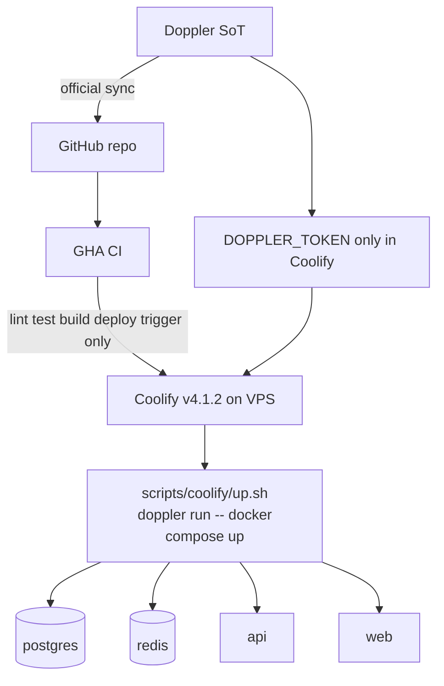
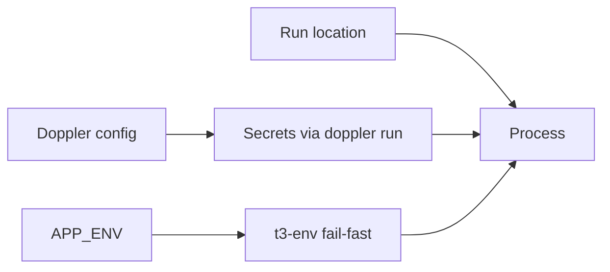

# Deploy secrets — Pattern A Doppler + Coolify

**Status:** accepted  
**Phase:** 0 (spec) · 0.5 (verify on VPS)  
**Date:** 2026-07-31

Secrets live in **Doppler** (source of truth). Runtime injection uses **Pattern A only** — compose-level `doppler run`, no B2 secret copy into Coolify DB, no GHA as prod secret broker.

## Topology



## Pattern A — compose-level

Coolify stores **only** `DOPPLER_TOKEN` (service token). Deploy/start wraps the entire stack:

```bash
doppler run -- docker compose up -d
```

Implemented as `scripts/coolify/up.sh`. Postgres, Redis, web, and api all receive env vars from the same Doppler config fetch — no per-service secret UI in Coolify.

| Piece | Behavior |
| --- | --- |
| **Coolify** | v4.1.2 · Docker Compose build pack · custom start via repo script |
| **Doppler CLI** | On VPS host or wrapper image · fetches at deploy/restart |
| **GHA** | CI via Doppler↔GitHub sync for tests · deploy webhook/trigger only |
| **Fallback volume** | Skipped — Doppler down + restart = fail until recovered |

**Phase 0.5 checklist:** Doppler CLI on host · Preserve Repository + correct project directory · `t3-env` validates after inject · smoke test on VPS.

## Environment matrix

Three **independent** axes — not 1:1 mapped:

| Axis | Values | Purpose |
| --- | --- | --- |
| **APP_ENV** | `dev` \| `prod` | Runtime guards (`t3-env`, feature flags) |
| **Doppler config** | `dev` \| `prod` \| `dev_personal` | Secret payloads |
| **Run location** | local · Coolify resource | Where process executes |

**No staging environment** — only dev and prod configs. Personal experiments use `dev_personal`.



## Runtime config — not NEXT_PUBLIC

Do **not** bake env-specific values into `NEXT_PUBLIC_*` at build time. Same image runs everywhere; env-specific public config comes from:

- Server-injected config, or
- `/v1/config` runtime endpoint

Secrets and env-specific URLs stay server-side. `NEXT_PUBLIC_API_URL` and `NEXT_PUBLIC_APP_URL` are set at runtime via Doppler — not compile-time prod secrets.

## Auth URL mirrors (Elysia, not Next API)

Better Auth runs on **Elysia** at `/v1/auth/*`. No Next.js API routes.

| Key | Must equal |
| --- | --- |
| `BETTER_AUTH_URL` | `NEXT_PUBLIC_API_URL` |
| `API_CORS_ORIGIN` | `NEXT_PUBLIC_APP_URL` |

GitHub OAuth callback: `{BETTER_AUTH_URL}/v1/auth/callback/github`

Web client uses `createAuthClient({ baseURL: "{NEXT_PUBLIC_API_URL}/v1/auth" })`.

## Doppler key catalog

Key names and config rules live in `.env.example` (domain-grouped catalog) and `packages/env/src/manifest.ts`. Values are **only** in Doppler.

| Doppler config | Use |
| --- | --- |
| `dev_personal` | Local laptop — `DB_URL` + `REDIS_URL` in Doppler, no compose |
| `dev` | Coolify deploy — `POSTGRES_PASSWORD`; compose wires `DB_URL` / `REDIS_URL` |
| `prod` | Production deploy — same wiring as `dev` |

Scripts: `doppler:setup`, `doppler:validate`, `doppler:clear` (wipe config for re-import; `prod` requires `--yes`), `dev` (`doppler run --config dev_personal -- turbo dev`).

## Considered options

| Option | Rejected because |
| --- | --- |
| **B2** — GHA pushes all secrets to Coolify API | Secrets at rest in Coolify DB; orphan keys; GHA blast radius |
| **B1/B3** — manual Coolify env per key | Drift from Doppler SoT |
| **Staging config** | Solo/small-team overhead; dev_personal covers experiments |

## Consequences

- Next.js builds must not depend on prod-only public env at compile time.
- Coolify must allow custom compose start command (verified feasible on v4.1.2; confirm on VPS in 0.5).
- Local dev: `doppler run --config dev_personal -- bun dev` (or equivalent).
