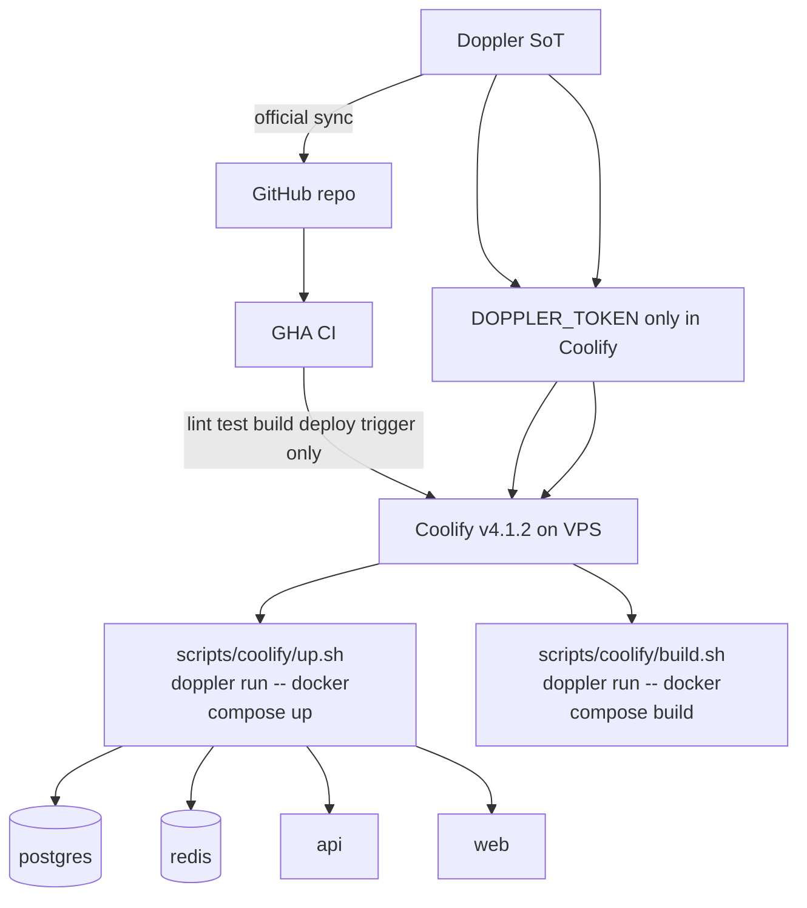
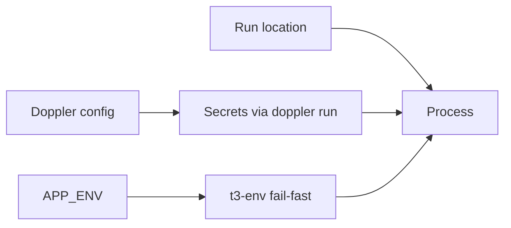

# Deploy secrets — Pattern A Doppler + Coolify

**Status:** accepted  
**Phase:** 0 (spec) · 0.5 (verify on VPS)  
**Date:** 2026-07-31

Secrets live in **Doppler** (source of truth). Runtime injection uses **Pattern A only** — compose-level `doppler run`, no B2 secret copy into Coolify DB, no GHA as prod secret broker.

## Topology



## Pattern A — compose-level

Coolify stores **only** `DOPPLER_TOKEN` (service token). Deploy/start wraps the entire stack:

```bash
doppler run -- docker compose up -d
```

Implemented as `scripts/coolify/up.sh`. Image build uses `scripts/coolify/build.sh` with the same Doppler injection. Postgres, Redis, web, and api receive env vars only through explicit `environment:` entries in `docker-compose.yml` (Doppler Option 2) — the host shell from `doppler run` does not automatically reach containers.

| Piece | Behavior |
| --- | --- |
| **Coolify** | v4.1.2 · Docker Compose build pack · custom **build** via `bash scripts/coolify/build.sh --pull` · custom **start** via `bash scripts/coolify/up.sh -d` |
| **Doppler CLI** | Host `doppler` or `bunx doppler` in Coolify helper (`scripts/coolify/ensure-doppler.sh`) · fetches at build and deploy/restart |
| **GHA** | CI via Doppler↔GitHub sync for tests · deploy webhook/trigger only |
| **Fallback volume** | Skipped — Doppler down + restart = fail until recovered |
| **Smoke** | Chained at end of `scripts/coolify/up.sh` (health, config, web root). Auto-detects **loopback** (local host) vs **compose-exec** (Coolify helper — published ports are on Docker host, not helper loopback). Override with `SMOKE_MODE=loopback\|compose-exec`. |

**Phase 0.5 checklist:** Doppler CLI on host · Preserve Repository + correct project directory · `t3-env` validates after inject · `build.sh` then `up.sh` on VPS (smoke runs at end of up).

## Environment matrix

Three **independent** axes — not 1:1 mapped:

| Axis | Values | Purpose |
| --- | --- | --- |
| **APP_ENV** | `dev` \| `prod` | Runtime guards (`t3-env`, feature flags) |
| **Doppler config** | `dev` \| `prod` \| `dev_personal` | Secret payloads |
| **Run location** | local · Coolify resource | Where process executes |

**No staging environment** — only dev and prod configs. Personal experiments use `dev_personal`.



## Runtime config — not NEXT_PUBLIC (long-term)

Do **not** bake env-specific values into `NEXT_PUBLIC_*` at build time long-term. Same image runs everywhere; env-specific public config should come from:

- Server-injected config, or
- `/v1/config` runtime endpoint

### Interim deviation (2026-07-31)

Until `/v1/config` client bootstrap ships, the web Dockerfile accepts `NEXT_PUBLIC_APP_URL` and `NEXT_PUBLIC_API_URL` as **build args** (injected by `doppler run -- docker compose build`). Consequence: the web image is **environment-specific** — a dev-built image must not be promoted to prod. Runtime `environment:` on the web service still passes the same keys for server-side reads; they do not rewrite an already-built client bundle.

Remove this deviation when the web client loads public URLs from `/v1/config` (or equivalent) and build args are deleted from compose + Dockerfile.

Secrets stay server-side at runtime via compose `environment:` passthrough. Never set `ENV_SKIP_VALIDATION` or `CI=true` in Docker or compose — both disable t3-env fail-fast guards.

## Auth URL mirrors (Elysia, not Next API)

Better Auth runs on **Elysia** at `/v1/auth/*`. No Next.js API routes.

| Key | Must equal |
| --- | --- |
| `BETTER_AUTH_URL` | `NEXT_PUBLIC_API_URL` |
| `API_CORS_ORIGIN` | `NEXT_PUBLIC_APP_URL` |

GitHub OAuth callback: `{BETTER_AUTH_URL}/v1/auth/callback/github`

Web client uses `createAuthClient({ baseURL: "{NEXT_PUBLIC_API_URL}/v1/auth" })`.

## Doppler key catalog

Key names and config rules live in `.env.example` (domain-grouped catalog) and `packages/env/src/manifest.ts`. Values are **only** in Doppler.

| Doppler config | Use |
| --- | --- |
| `dev_personal` | Local laptop — `DB_URL` + `REDIS_URL` in Doppler, no compose |
| `dev` | Coolify deploy — `POSTGRES_PASSWORD`; compose wires `DB_URL` / `REDIS_URL` |
| `prod` | Production deploy — same wiring as `dev` |

Scripts: `doppler:setup`, `doppler:validate`, `doppler:clear` (wipe config for re-import; `prod` requires `--yes`), `dev` (`doppler run --config dev_personal -- turbo dev`).

## Considered options

| Option | Rejected because |
| --- | --- |
| **B2** — GHA pushes all secrets to Coolify API | Secrets at rest in Coolify DB; orphan keys; GHA blast radius |
| **B1/B3** — manual Coolify env per key | Drift from Doppler SoT |
| **Staging config** | Solo/small-team overhead; dev_personal covers experiments |

## Consequences

- Next.js builds currently depend on interim build-time `NEXT_PUBLIC_*` (see Interim deviation); remove when `/v1/config` lands.
- Compose `environment:` must list every Doppler key each container needs — updating `packages/env/src/manifest.ts` requires updating compose.
- Do not use `${VAR:?message}` or empty `${VAR:-}` in compose — validation belongs in `doppler:validate` and t3-env, not Docker Compose fallbacks (Coolify misreads them at build time).
- Coolify custom build and start commands required (verified feasible on v4.1.2; confirm on VPS in 0.5). Start: `bash scripts/coolify/up.sh` (includes `-d`, `--wait`, smoke). `DOPPLER_TOKEN` must be a **Build Variable** in Coolify; `ensure-doppler.sh` sources `/artifacts/build-time.env` because Coolify only auto-injects `--env-file` into `docker compose`, not custom shell wrappers. Coolify helper (`ghcr.io/coollabsio/coolify-helper:1.0.14`) has no bun/gnupg — deploy scripts install `doppler` via Alpine `apk` (official Doppler repo) and use `scripts/coolify/doppler-validate.sh` instead of `bun run doppler:validate`.
- `api` and `web` use `expose` only (no host publish in git compose). Coolify still injects shared `127.0.0.1:3000/3001` host binds from domain UI config into the deploy artifact — `scripts/coolify/up.sh` writes `docker-compose.override.yml` with `ports: !reset []` per api/web service (including `api-pr-N`) before `docker compose up` auto-merges it.
- In Coolify, assign domains with container ports: web `:3000`, api `:3001`. Preview URLs fall back from Doppler via `SERVICE_URL_WEB_3000` / `SERVICE_URL_API_3001` when `NEXT_PUBLIC_*` is unset.
- Postgres and Redis are internal-only (no host port publish) in deploy compose.
- Local dev: `doppler run --config dev_personal -- bun dev` (or equivalent).
