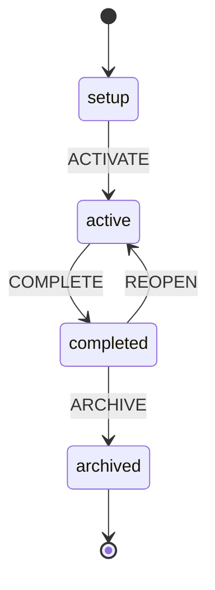
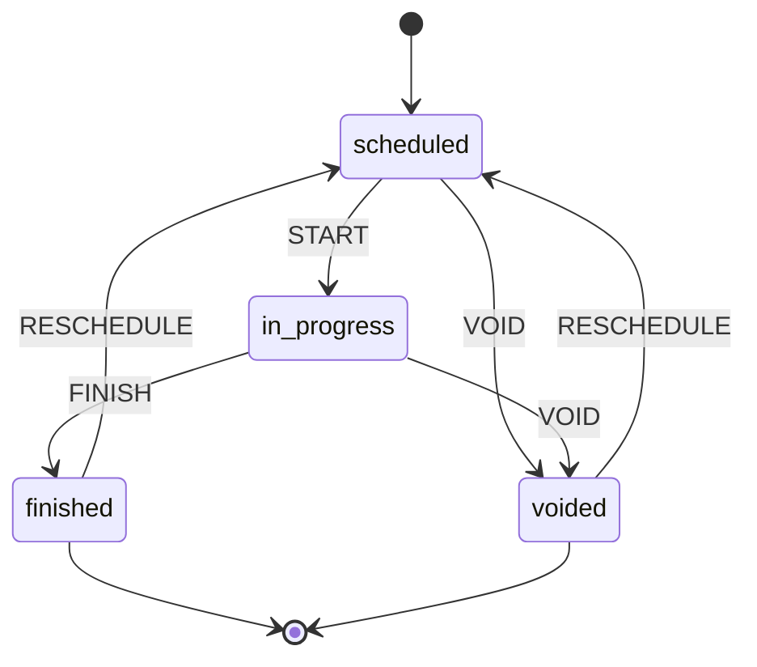
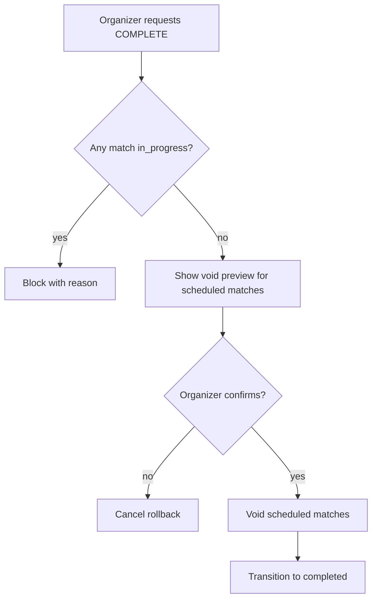
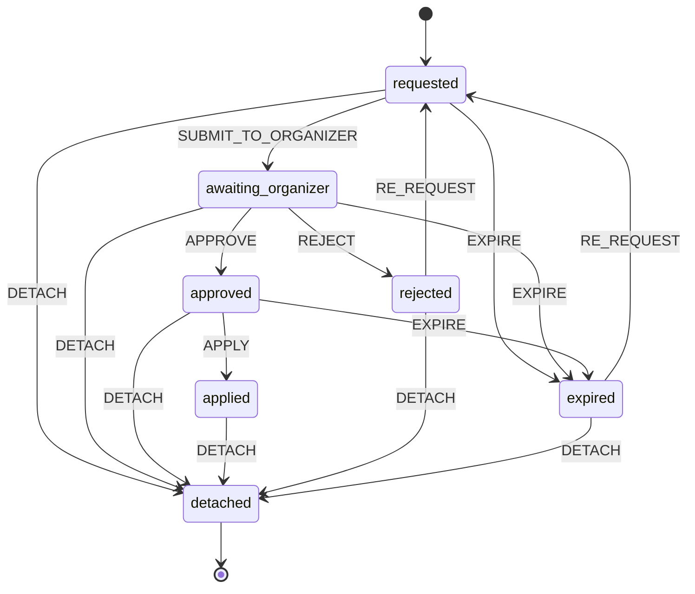
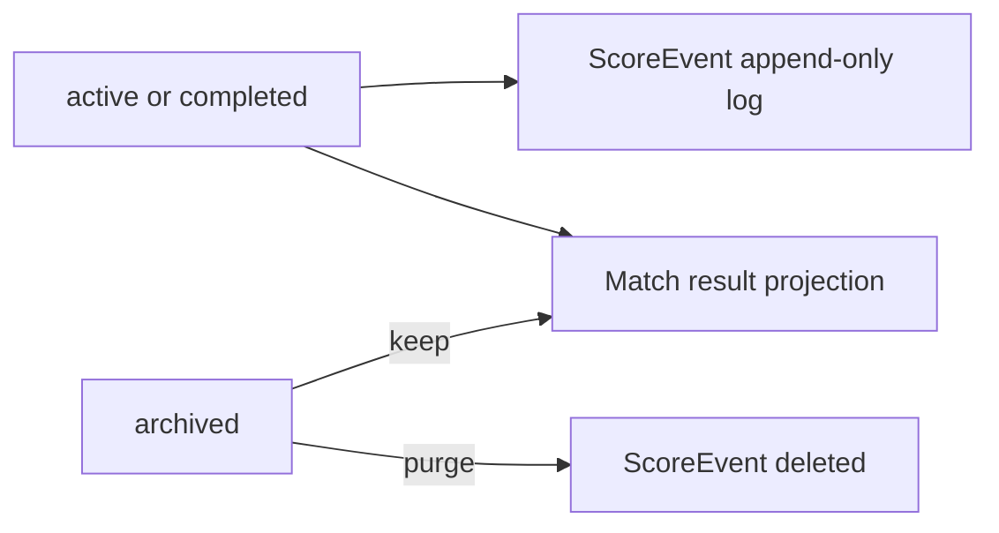

# Domain lifecycle and scoring

**Status:** accepted  
**Phase:** 0  
**Date:** 2026-07-31  
**Supersedes:** any prior use of `draft` for PlaySession initial state

Domain transitions are **deterministic pure functions** in `packages/domain`: `transition(status, event) → status | throw`. Same input always yields same output. Zod validates event payloads; machines do not use XState.

## PlaySession lifecycle

Initial state is **`setup`**, not `draft` — roster and matches are editable until play starts; this is configuration, not unpublished content.

| State | Meaning |
| --- | --- |
| `setup` | Roster and matches configurable; no live scoring |
| `active` | Live scoring allowed; ScoreEvent log writable |
| `completed` | Play stopped; SlotClaim window open; ScoreEvent kept for Organizer review |
| `archived` | Frozen — no score edits, no new SlotClaims; **ScoreEvent purged** |

**Visibility** (public/private on profile) is a separate attribute — not a lifecycle state. An archived PlaySession may still appear on a public profile.

## Match lifecycle

## Completing a PlaySession — void rules and confirmation UX

PlaySession cannot move to `completed` while any Match is `scheduled` or `in_progress`.

| Situation | System behavior | UX |
| --- | --- | --- |
| Match `in_progress` | **Block** complete | Confirmation message: finish or void the match first; explain why blocked |
| Match `scheduled`, never started | On complete intent | **Confirmation dialog** listing all matches that will be **voided** with current status; Organizer may cancel |
| Match `finished` | No change | Included in completed session |
| After confirm | Force remaining `scheduled` → `voided` | All matches terminal (`finished` or `voided`) before `completed` |

## SlotClaim lifecycle

Organizer approval required before `applied`. Player cannot self un-claim; detach is Organizer or PlatformAdmin support path.

## Scoring model

### Who can score

| Actor | Live score read | Score controls |
| --- | --- | --- |
| **Slot holder** (any Match in PlaySession) | Yes | Yes — +1, −1, type, undo/redo as ScoreEvents |
| **Spectator** (link/QR, not on Slot) | Yes | **No** — read-only |
| **Organizer** | Yes | Yes + override/void powers |

Any Slot holder acts as scorekeeper (buddy on sideline, rotating player, or real referee) — same feature, metadata records actor slot.

### ScoreEvent — ephemeral log

| Action | Implementation |
| --- | --- |
| +1 / −1 | New ScoreEvent per tap |
| Type score | Direct entry event (format presets per research) |
| Undo / redo | New ScoreEvent referencing prior event — log stays immutable |
| MatchScore | Projection from ScoreEvents while live |
| After archive | Trust Match result; no tap-by-tap replay |

### Spectator

Shareable **Spectator link** per PlaySession — read-only WebSocket channel. Same live score panel as participants; scorer controls hidden/disabled.

## Scoring engines (future adapters)

MVP intent from [padel domain research](../research/padel-domain-official-sources/deep-research-brief.md):

1. **Standard Match** — FIP-aligned reference (15-30-40, deuce strategies, tie-break +1).
2. **Rotation Social** — Americano/Mexicano +1 rally (non-FIP, labeled as social format).

Organizer selects format in `setup`; deuce type and set presets configurable.

### G1 implementation default (locked for first vertical slice)

Per [R3 padel domain research](../research/padel-domain-official-sources/deep-research-brief.md) and [fusion premortem](../research/fusion-premortem-phase1.md):

| Setting | G1 default | Defer to E2 |
| --- | --- | --- |
| Match format | **Standard Match** | Rotation Social (Americano/Mexicano) |
| Deuce | **Golden Point** | Star Point, Advantage |
| Sets | **Best of 1** | Best of 3, mini-set variants |
| Tie-break | Numeric +1 to 7, win by 2 | Match TB / super TB variants |

FIP typo note: Golden Point wins the **game**, not the match — implement accordingly.

## Lifecycle vs visibility

| Concern | Model |
| --- | --- |
| Lifecycle (`setup` … `archived`) | State machine |
| Visibility (profile/session public) | Policy enum — not an SM state |
