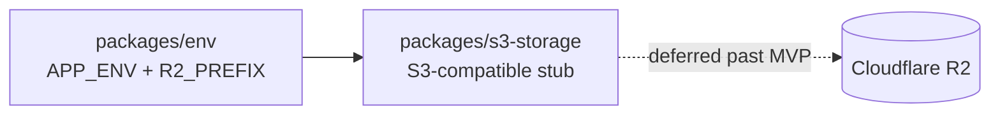
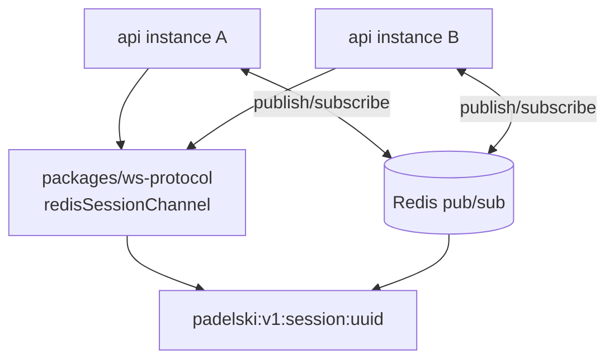

# Object storage and Redis wiring

**Status:** accepted  
**Phase:** 0  
**Date:** 2026-08-01

Phase 0 locks **where** object storage and Redis live in the monorepo and **what** is stubbed vs deferred. Avatar/asset uploads and multi-instance WS fanout ship later; this ADR prevents ad-hoc clients in `apps/api` or a premature `packages/redis` package.

## Object storage — Cloudflare R2

| Concern | Decision |
| --- | --- |
| Provider | **Cloudflare R2** (S3-compatible API) |
| Package | **`packages/s3-storage`** (`@padelski/s3-storage`) — dedicated S3-compatible module, not inline in api |
| Phase 0 | **Stub** — exports placeholder types/helpers; no real upload path |
| Real client | When avatar/asset upload stories ship — **deferred past MVP** |
| Env keys | `R2_ACCOUNT_ID`, `R2_ACCESS_KEY_ID`, `R2_SECRET_ACCESS_KEY`, `R2_BUCKET_NAME`, `R2_PREFIX` in `packages/env` |
| Key prefix | **`R2_PREFIX`** defaults to `dev/` when `APP_ENV=dev`, `prod/` when `APP_ENV=prod`. t3-env **validates** that explicit `R2_PREFIX` matches `APP_ENV` — no cross-env object keys |

**Consequence:** api and web import `@padelski/s3-storage` when uploads land; no duplicate S3 client wiring across apps.

## Redis — no `packages/redis`

| Concern | Decision |
| --- | --- |
| Infra | **`redis`** service in `docker-compose.yml` |
| Connection | **`REDIS_URL`** in `packages/env` (compose-wired at deploy) |
| Client | **`apps/api` connects directly** (e.g. **ioredis**) when WS pub/sub fanout ships |
| Shared package | **No `packages/redis`** for Phase 0 — thin connection helper stays in api until a second consumer exists |

Today live score uses in-process fanout in api; Redis pub/sub replaces that when horizontal scale or multi-instance deploy requires it.

## WS pub/sub channel contract

Channel naming is **not** api-local string literals. It lives in **`packages/ws-protocol`**:

| Symbol | Value |
| --- | --- |
| Prefix | `padelski:v1` (versioned with `WS_PROTOCOL_VERSION`) |
| Session channel | `padelski:v1:session:{playSessionId}` via `redisSessionChannel(playSessionId)` |

api imports the helper when subscribing/publishing; contract tests in ws-protocol prevent drift between instances.

## Activity log vs audit trail vs ScoreEvent

See [ADR-0005](./0005-activity-and-audit-logs.md).

## Consequences

- `packages/s3-storage` exists as a stub; no R2 credentials required for MVP CI beyond optional env validation.
- Redis is infra + env only until WS fanout epic; no premature abstraction package.
- Channel names are versioned and centralized in ws-protocol before multi-instance deploy.
