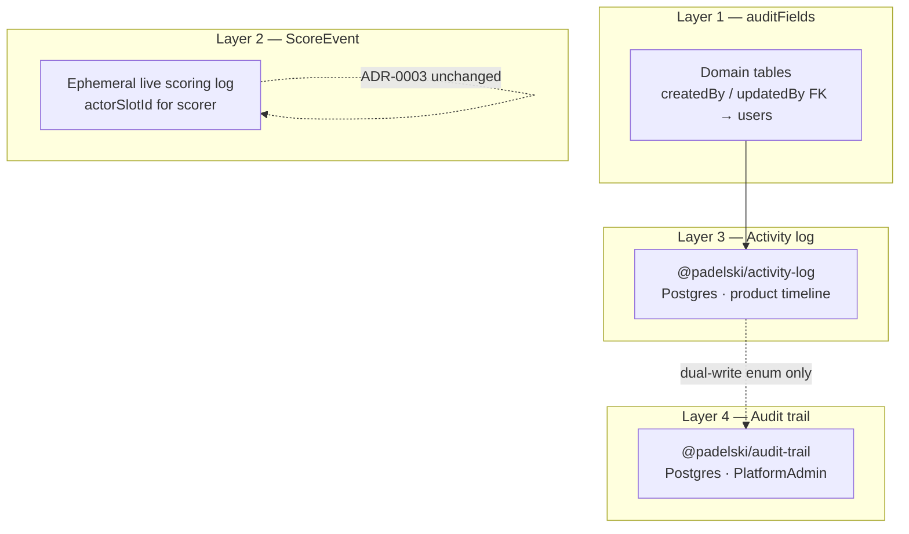
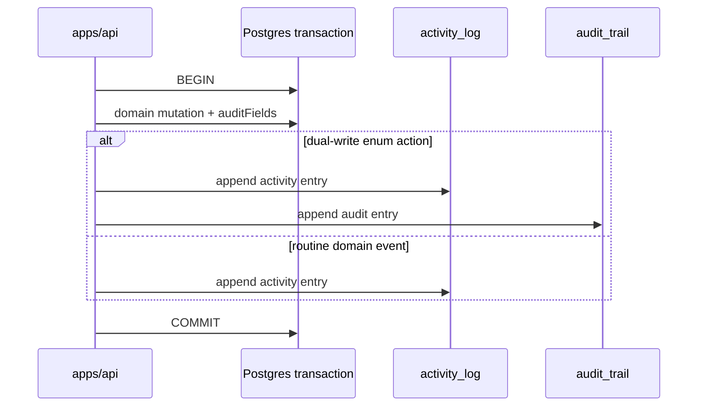

# Activity and audit logs

**Status:** accepted  
**Phase:** 0  
**Date:** 2026-08-01

Phase 0 locks the **four-layer observability model** for padelski.id: row-level audit fields on domain tables, ephemeral **ScoreEvent** (unchanged), durable **activity log** for product timelines, and append-only **audit trail** for PlatformAdmin support. This ADR resolves the split deferred in [ADR-0004](./0004-object-storage-and-redis-wiring.md).

## Four layers

| Layer | Storage | Primary consumer | UI surface |
| --- | --- | --- | --- |
| **auditFields** | Columns on every domain table | ORM / queries | — |
| **ScoreEvent** | `score_events` table | Live score projection | PlaySession scorer + Spectator |
| **Activity log** | `activity_log` (Postgres) | Session/product timeline | `/app/play-sessions/*` |
| **Audit trail** | `audit_trail` (Postgres) | PlatformAdmin support | `/app/platform-admin/audit` |

Platform operator UI lives under **`/app/platform-admin/*`** only — **PlatformAdmin** scope. Do not route platform support tools under `/admin` or Org-scoped paths.

## Layer 1 — auditFields on domain tables

Every domain table in `packages/db` spreads **`auditFields`** with mandatory actor FKs:

| Column | Type | Rule |
| --- | --- | --- |
| `createdBy` | FK → `users.id` | Set on insert from authenticated session |
| `updatedBy` | FK → `users.id` | Set on every update from authenticated session |

Shared timestamp/id/soft-delete columns (`id`, `createdAt`, `updatedAt`, `deletedAt`) remain as today. **`createdBy` / `updatedBy` are mandatory** on all domain tables — no nullable actor columns on routine CRUD.

### ScoreEvent exception

**ScoreEvent** follows [ADR-0003](./0003-domain-lifecycle-and-scoring.md) unchanged for lifecycle and purge rules. For the **scoring actor**, use **`actorSlotId`** (FK → `slots.id`) — not `createdBy` / `updatedBy` — because any Slot holder may score and the actor is a roster seat, not always the OAuth user behind the tap.

| Table | Actor columns |
| --- | --- |
| All domain tables except ScoreEvent | `createdBy`, `updatedBy` → users |
| ScoreEvent | `actorSlotId` → slots (scoring actor); row timestamps only otherwise |

## Layer 2 — ScoreEvent (unchanged)

See [ADR-0003](./0003-domain-lifecycle-and-scoring.md):

- Append-only during `active` and `completed`
- **Purged on `archived`**; Match result projection kept
- Not an activity log, not an audit trail — ephemeral live-scoring telemetry only

No additional logging layers wrap ScoreEvent rows.

## Layer 3 — Activity log

| Concern | Decision |
| --- | --- |
| Package | **`@padelski/activity-log`** (`packages/activity-log`) |
| Persistence | **PostgreSQL** append-only table(s) owned by the package schema |
| Purpose | Product-facing **who did what, when** on PlaySession domain events |
| UI | Session/product **timeline** under **`/app/play-sessions/*`** — visible to Organizer and Participants in scope; **not** PlatformAdmin |

Example actions (closed enum, extend via ADR amendment): `play_session.created`, `play_session.activated`, `match.scheduled`, `slot_claim.requested`, `slot_claim.approved`.

### Indexes — activity log

| Index | Columns | Use |
| --- | --- | --- |
| Subject timeline | `(subject_type, subject_id, occurred_at DESC)` | PlaySession detail timeline |
| Actor lookup | `(actor_id, occurred_at DESC)` | Filter by Player |
| Action filter | `(action, occurred_at DESC)` | Ops/debug queries |

### Retention — activity log

| Policy | Value |
| --- | --- |
| Default retention | **Life of subject + 90 days** after PlaySession `archived` |
| Purge job | Scheduled; hard-delete rows past retention |
| Legal hold | PlatformAdmin may flag subject — suspend purge until cleared |

## Layer 4 — Audit trail

| Concern | Decision |
| --- | --- |
| Package | **`@padelski/audit-trail`** (`packages/audit-trail`) — **Option A: two packages** (activity-log + audit-trail), not a merged logging module |
| Persistence | **PostgreSQL** append-only; **no UPDATE/DELETE** on trail rows |
| Purpose | Durable record of **PlatformAdmin and cross-tenant support** actions |
| UI | **`/app/platform-admin/audit`** — PlatformAdmin scope only |

Trail entries capture: actor (PlatformAdmin user id), action enum, subject type/id, tenant/session context, structured metadata, `occurred_at`.

### Indexes — audit trail

| Index | Columns | Use |
| --- | --- | --- |
| Time scan | `(occurred_at DESC)` | Default admin list (newest first) |
| Subject | `(subject_type, subject_id, occurred_at DESC)` | Investigate one PlaySession/Player |
| Actor | `(actor_id, occurred_at DESC)` | Review one operator's actions |
| Action | `(action, occurred_at DESC)` | Filter by support action type |

### Retention — audit trail

| Policy | Value |
| --- | --- |
| Default retention | **24 months** minimum |
| Purge job | Scheduled; append-only until retention window expires |
| Export | PlatformAdmin may export before purge for dispute records |

## Dual-write policy

Routine domain mutations write **activity log only** inside the same DB transaction as the domain change.

**Dual-write** (activity log **and** audit trail in one transaction) applies only to a **closed enum** of PlatformAdmin / security-sensitive actions:

| Action | Dual-write |
| --- | --- |
| `platform_admin.slot_claim.detach` | Yes |
| `platform_admin.cross_tenant.support` | Yes |
| `auth.elevation.granted` | Yes |
| Routine Organizer/Participant domain events | Activity log only |

**Requirement:** activity append (and audit append when required) MUST succeed or roll back **with** the domain mutation — no post-commit logging.

## Package layout — Option A

| Package | Responsibility |
| --- | --- |
| `@padelski/activity-log` | Zod action enums, writer interface, Drizzle schema, Postgres persistence |
| `@padelski/audit-trail` | Separate Zod enums, append-only writer, Drizzle schema, Postgres persistence |

`apps/api` imports both; `apps/web` reads via API — no direct DB access from web.

## Consequences

- `packages/db` auditFields gain `createdBy` / `updatedBy`; ScoreEvent keeps `actorSlotId` per ADR-0003.
- `packages/audit-trail` is added alongside existing `packages/activity-log` stub.
- Product timelines ship under `/app/play-sessions/*`; platform support audit UI ships at `/app/platform-admin/audit`.
- Dual-write surface stays small and enum-closed; routine events stay activity-only for simpler queries and retention.
