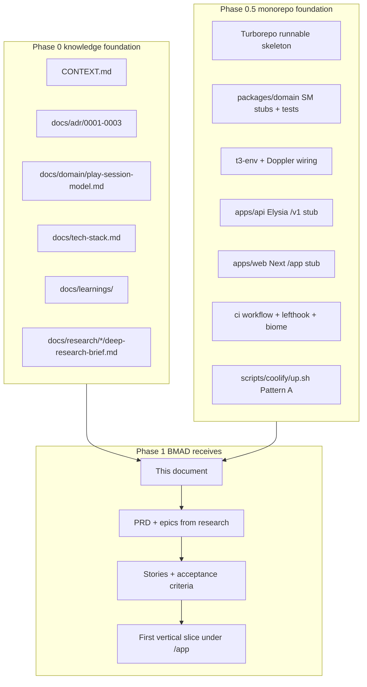
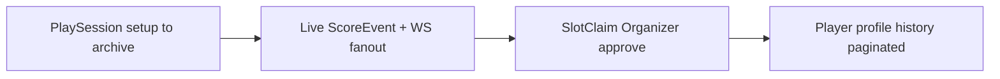

# Phase 1 ready — BMAD handoff

**Date:** 2026-07-31  
**Audience:** BMAD agents (PM, architect, dev, QA)  
**Prerequisite:** Phase 0 spec docs + Phase 0.5 monorepo scaffold complete

BMAD starts **after** both foundations exist. Phase 1 does not re-grill Phase 0 decisions unless a story discovers a contradiction — then file a learning and supersede via ADR.

## Handoff package

## What BMAD receives

### Frozen product intent (do not re-litigate without ADR)

| Area | Source | Locked decisions |
| --- | --- | --- |
| Ubiquitous language | `CONTEXT.md` | PlaySession, Match, Slot, SlotClaim, nickname, Spectator, Platform/Org scope |
| Product scope | ADR-0001 | Recreational unofficial realm; friendly matches MVP; GitHub OAuth; purge ScoreEvent on archive |
| Deploy / secrets | ADR-0002 | Pattern A Doppler; Coolify v4.1.2; APP_ENV dev\|prod; no staging |
| Lifecycle / scoring | ADR-0003 | `setup` not draft; void-on-complete UX; Spectator read-only; any Slot holder scores |
| Domain cardinality | `docs/domain/play-session-model.md` | 1 Player ↔ 1 Slot per session; detach effects; profile indexes |
| Stack | `docs/tech-stack.md` | Bun, Next, Elysia, Drizzle, Zod SoT, CASL stub, no XState, defer PWA |

### Research inputs (guidance — may refine UX defaults)

| Slug | Use in BMAD |
| --- | --- |
| `docs/research/competitor-landscape/` | Positioning, whitespace, geo sequencing |
| `docs/research/padel-domain-official-sources/` | Scoring engine presets, deuce types |
| `docs/research/competitor-gaps-usp/` | Feature candidates (when present) |
| `docs/learnings/inbox/` | Unpromoted hypotheses |

### Runnable repo (Phase 1 foundation — see `EPICS.md` for remaining stories)

| Path | State |
| --- | --- |
| `apps/web` | Next App Router, Mantine, `/app/play-sessions`, live score, profile history |
| `apps/api` | Elysia `/v1` PlaySession, Match, ScoreEvent, SlotClaim, config, WS live-score |
| `packages/domain` | PlaySession, Match, SlotClaim transitions + `evaluateCompletePlaySession()` |
| `packages/db` | Drizzle schema + migration `0000_solid_wrecker.sql` |
| `packages/auth` | Better Auth GitHub handler; CASL abilities stub (route guards → E4-S3) |
| `packages/env` | t3-env `APP_ENV` guard |
| `packages/ws-protocol` | v1 envelope + `score.update` (spectator_join → E2) |
| `docker-compose.yml` | Postgres + Redis + api + web |
| `scripts/coolify/up.sh` | `doppler run -- docker compose up` |

## First implementation vertical (BMAD epic hint)

Build one end-to-end path before breadth:

**Explicitly out of first slice:** booking integration, Org admin, federation tiers, PWA, Google OAuth.

## BMAD workflow entry

1. **Load** `CONTEXT.md` + ADRs + domain spec before any story.
2. **Run** `bmad-create-prd` / sprint planning using research briefs as evidence.
3. **Verify** domain changes against `packages/domain` tests and ADR-0003 mermaid.
4. **Promote** new durable learnings via `docs/learnings/README.md` flow.
5. **Do not** change stack or deploy pattern without new ADR.

## Verification gates

| Gate | Check | Status |
| --- | --- | --- |
| G0 | Phase 0 spec + research + fusion briefs | **Done** |
| G0.5 | `bun run lint` + `typecheck` + `test` green | **Done** ([Verify Phase 0.5 scaffold](ab144299-be04-4049-b349-6e93f63c2005)) |
| G0.5 | Drizzle domain schema + migration | **Done** ([Phase 1 MVP implementation](fa73b97e-8e1c-4fa9-b372-0fff5ab20bed)) |
| G0.5 | `/app` routes + API `/v1` foundation | **Done** |
| G0.5 | Doppler `dev_personal` + compose local smoke | **Open** (E6-S3) |
| G0.5 | Coolify VPS v4.1.2 smoke | **Open** (E6-S4) |
| G1 | First vertical slice (live score → claim → profile) | **Partial** — see [EPICS.md](./EPICS.md) |

## Open for BMAD stories (not blockers)

- Exact SlotClaim window TTL
- Public profile default visibility (research-informed)
- ScoreEvent conflict resolution when two slot holders disagree
- Standard vs Rotation Social scoring UI detail
- CASL ability matrix expansion

## Related

- [Phase flow diagram](../tech-stack.md) — stack snapshot
- [Learnings promotion](../learnings/README.md)
- `.bmad-loop/policy.toml` — orchestration when using bmad-loop

**Next step:** BMAD picks stories from [EPICS.md](./EPICS.md). MVP triad per [fusion compare](./../research/fusion-compare-status-quo.md): **PlaySession + live ScoreEvent + spectator link** first; SlotClaim UI in Epic E3 after repeat session usage.

**Scoring G1 default:** Golden Point deuce + best-of-1 set ([R3](../research/padel-domain-official-sources/deep-research-brief.md), [premortem](../research/fusion-premortem-phase1.md)). Star Point / Advantage + best-of-3 → Epic E2.
