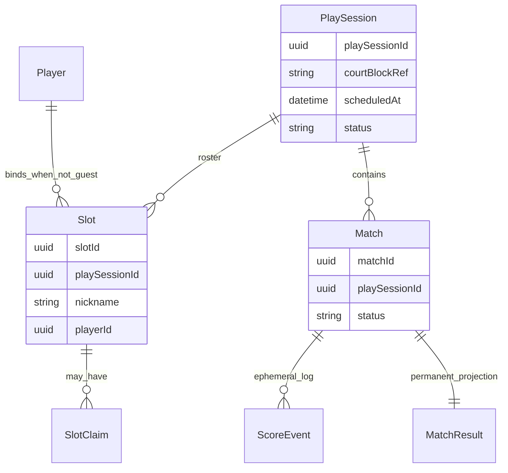
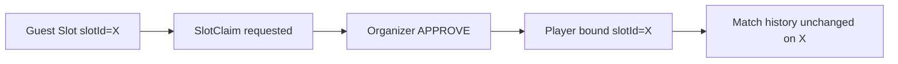
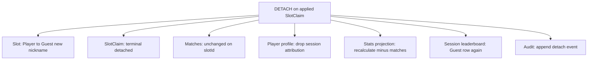
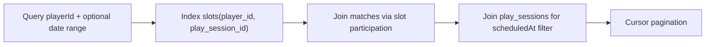

# PlaySession domain model

**Phase:** 0  
**Status:** spec (implementation in Phase 1 via BMAD)  
**Related:** [CONTEXT.md](../../CONTEXT.md) · [ADR-0003](../adr/0003-domain-lifecycle-and-scoring.md)

## Entity relationship

History attaches to **`slotId`**, never to nickname text. After SlotClaim, the same `slotId` keeps prior Match rows.

## Cardinality rules

| Relationship | Rule | Notes |
| --- | --- | --- |
| Court datetime block → PlaySession | **1 : n** | Same booking may spawn PlaySession B if A is wrong mode/roster; A persists |
| PlaySession → Organizer | **1 : 1** | CoOrganizer deferred |
| PlaySession → Slot | **1 : n** | Typical padel roster size |
| PlaySession → Match | **1 : n** | Round-robin / friendly rotation |
| Player → Slot (same PlaySession) | **1 : 1 max** | Weird double-nickname → PlatformAdmin escalation |
| Player → Slot (across PlaySessions) | **1 : n** | One slot per session attended |
| Guest → Player | via **SlotClaim** | Organizer approval required |
| Player without PlaySession | **allowed** | Player exists at signup with zero slots |

## Slot binding

| Binding | Identity | Participant role |
| --- | --- | --- |
| **Guest** | `nickname` only (random or typed) | No |
| **Player** | OAuth-backed + account nickname | Yes |

Match participation, leaderboard rows, and score actor metadata reference **`slotId`**.

## SlotClaim effects

| Event | Effect |
| --- | --- |
| **Approve + apply** | Guest → Player on same `slotId`; history retained; profile gains session attribution |
| **Reject** | Slot stays Guest; may RE_REQUEST |
| **Expire** | Claim window closed; Slot stays Guest |
| **Detach** (Organizer / PlatformAdmin) | Player → Guest with **new random nickname**; see side effects below |

### Detach side effects (whole app)

Nothing is silently deleted — **rebind + projection refresh**. Match rows and finished results stay on `slotId`; they no longer count toward the detached Player's global history.

## Player profile — query pattern

Profile history is **not** a full-table scan of all Slots. Query by indexed Player participation:

### Recommended indexes (Phase 1 implementation)

| Index | Purpose |
| --- | --- |
| `slots(player_id)` WHERE `player_id IS NOT NULL` | All sessions for a Player |
| `slots(play_session_id)` | Roster for session |
| `matches(play_session_id, status)` | Session match list |
| `matches(finished_at DESC)` + slot participation join | Profile history timeline |
| `(player_id, finished_at DESC)` on participation projection | **Primary profile history path** |
| `play_sessions(scheduled_at)` | Date-range filter J–K |

### Scale note

At ~12M Slot rows (1M sessions × ~4 slots), PostgreSQL remains appropriate with partial indexes and pagination. Headline stats (W/L, games played) should use a **`player_stats` rollup** updated on Match finish — O(1) dashboard reads (FotMob-style pattern: aggregates first, full history lazy).

### Public profile visibility

| Field | Default intent |
| --- | --- |
| Player.nickname | Public |
| Player.full_name | Private |
| Match history | Public unless opt-out (refine post R1–R2) |
| Archived sessions | May still show if visibility allows — lifecycle ≠ hidden |

## ScoreEvent vs Match result

| Store | Lifetime | Query use |
| --- | --- | --- |
| **ScoreEvent** | Until PlaySession `archived`, then **purged** | Live scoring, undo, dispute during session |
| **Match result** | Permanent | Profile history, leaderboards, stats rollup |

## Court booking reference

MVP: **metadata on PlaySession** (`courtBlockRef`, `scheduledAt`) — no separate CourtBooking aggregate. External booking apps (Courtside, AYO) remain source of truth for court payment.

## Implementation alignment

State machine stubs in `packages/domain` must match this spec:

- PlaySession: `setup` | `active` | `completed` | `archived`
- Match: `scheduled` | `in_progress` | `finished` | `voided`
- SlotClaim: `requested` | `awaiting_organizer` | `approved` | `applied` | `rejected` | `expired` | `detached`

See [ADR-0003](../adr/0003-domain-lifecycle-and-scoring.md) for transition diagrams and confirmation UX.
