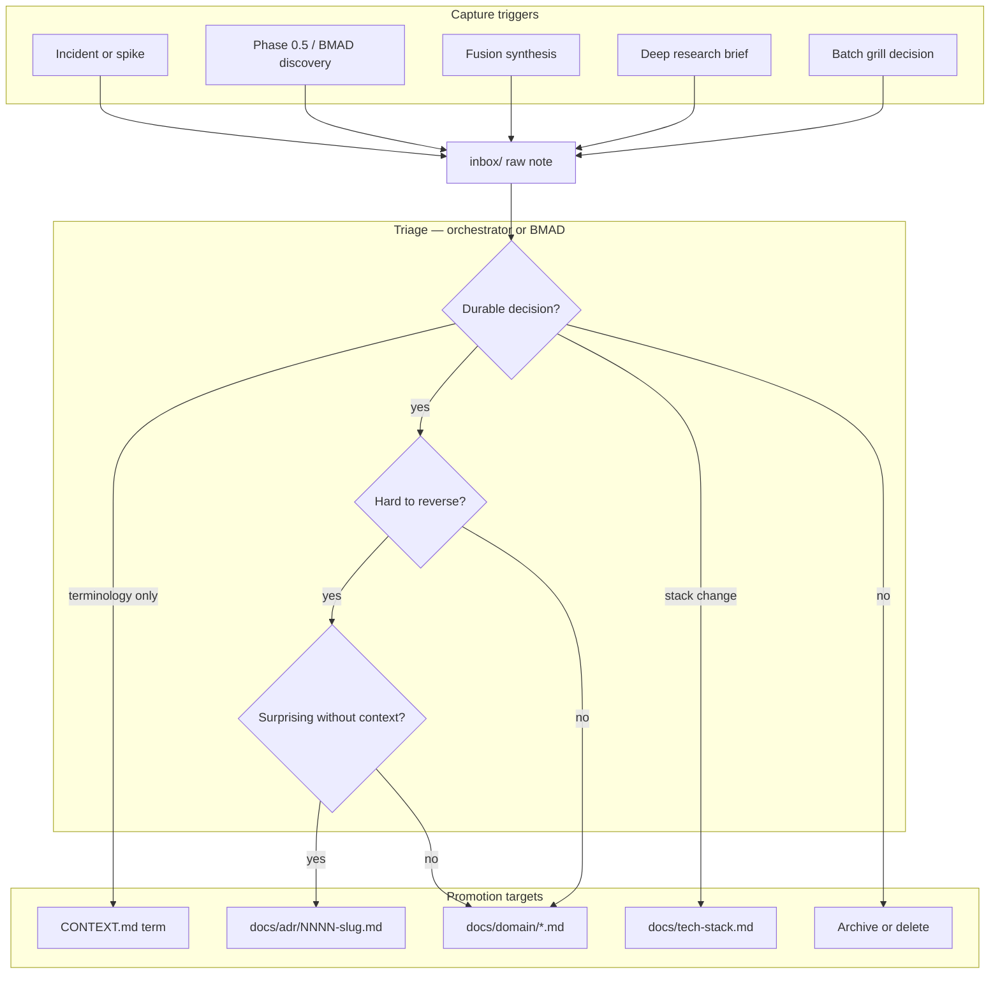

# Learnings inbox

**Phase:** 0  
**Purpose:** Capture hypothesis-grade notes during grill, research, fusion, and implementation — promote durable decisions into ADRs, domain specs, or CONTEXT when they stabilize.

## Layout

```
docs/learnings/
├── README.md          ← this file (promotion flow)
└── inbox/             ← raw notes (YYYY-MM-DD-slug.md)
    └── .gitkeep
```

Write new learnings to `docs/learnings/inbox/` with date prefix. One insight per file when possible.

## Promotion flow



After promotion, add a one-line footer to the inbox note: `Promoted → docs/adr/0004-….md` and move to `inbox/archive/` if historical context matters.

## Promotion triggers (from batch grill)

Use these signals to decide **inbox → promoted spec**:

| Trigger | Promote to | Example from grill |
| --- | --- | --- |
| **Terminology locked** | `CONTEXT.md` | `nickname` not display name; `SlotClaim` not claim |
| **Hard-to-reverse architecture** | `docs/adr/` | Pattern A Doppler; Zod SoT; recreational unofficial realm |
| **State / cardinality rules** | `docs/domain/` + ADR-0003 | 1 Player ↔ 1 Slot per PlaySession; detach side effects |
| **Stack choice with lock-in** | `docs/tech-stack.md` | Bun, Elysia, Drizzle, no XState |
| **Research finding → product default** | ADR or domain spec | FIP deuce presets; Golden Point default candidate |
| **UX principle (long-term)** | ADR-0001 or domain | Power user mobile + PC |
| **Explicit defer** | Inbox note only | PWA, Google OAuth, federation ABAC |
| **0.5 mechanical verify** | Inbox → close after smoke | Coolify v4.1.2 `doppler run` on VPS |
| **Contradiction with code** | Inbox + fix story | SM uses `setup` not `draft` |

## What stays in inbox

- Competitor metrics (self-reported, unverified)
- Open questions awaiting R2/R4/fusion
- Spike results that did not change decisions
- Personal preference notes not yet team-agreed

## What must not live only in inbox

- Legal lifecycle transitions
- Auth provider order (GitHub now)
- Purge ScoreEvent on archive
- API `/v1` versioning rule
- One-term-only vocabulary

These are already captured in Phase 0 spec docs — new learnings must not contradict them without a superseding ADR.

## Inbox note template

```markdown
# YYYY-MM-DD — short title

**Source:** grill | research/R1 | fusion | spike  
**Status:** raw | promoted | superseded

## Observation

One paragraph.

## Proposed action

- [ ] Promote to ADR
- [ ] Promote to CONTEXT
- [ ] Defer to BMAD story
- [ ] Discard
```
